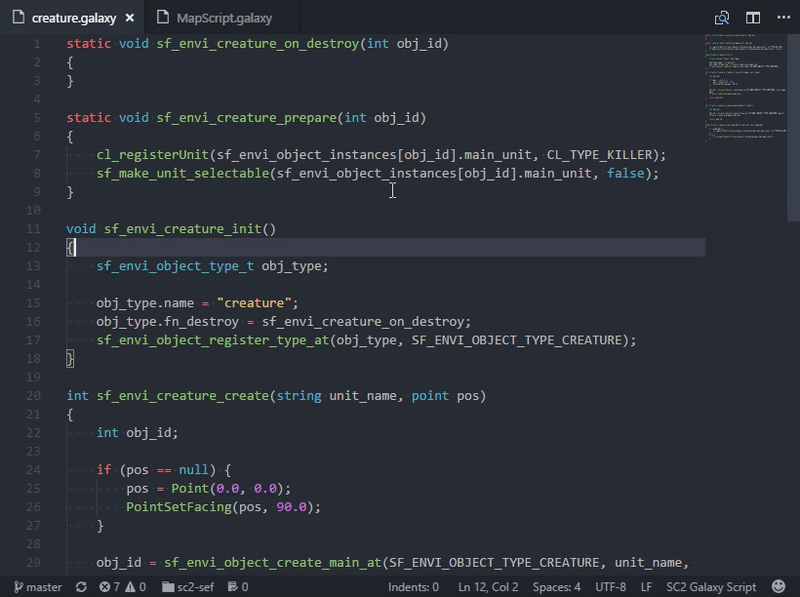
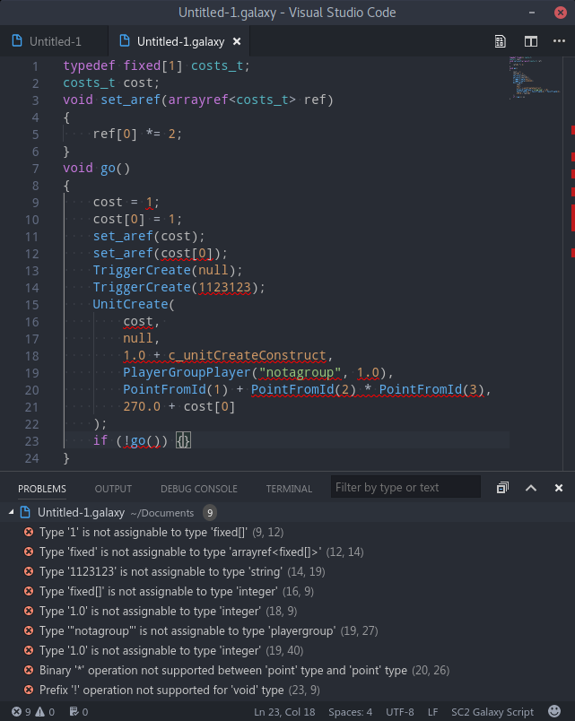
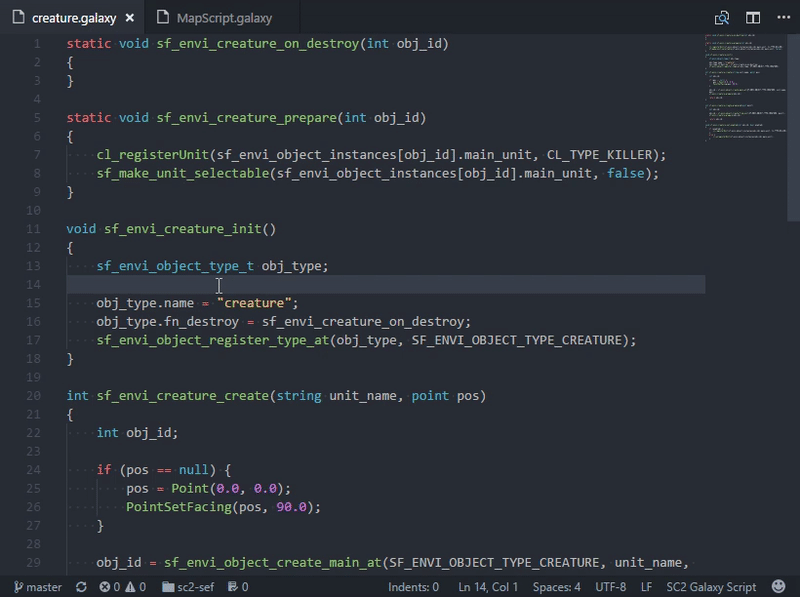
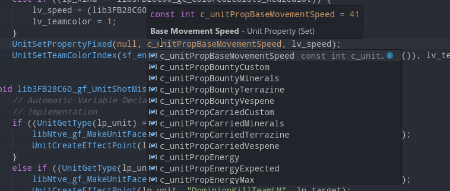
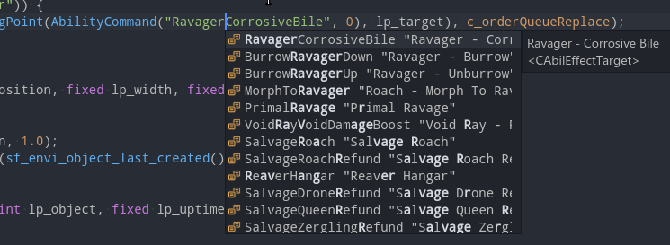
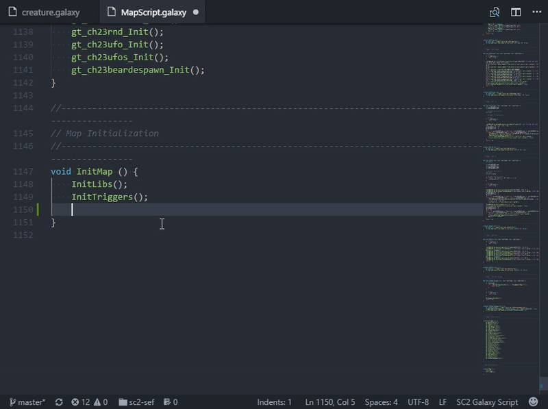
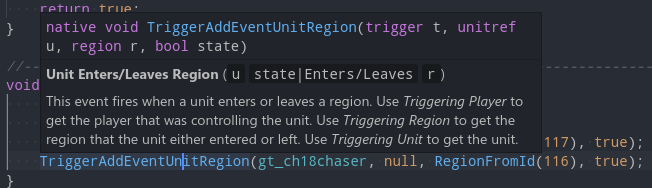
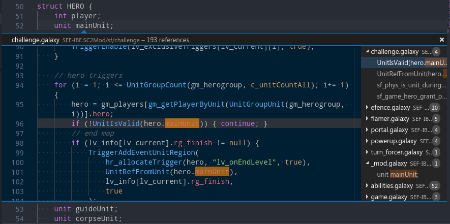

# StarCraft 2 Galaxy Script IDE

Rich set of utilities providing IDE like capabilities for StarCraft 2 Galaxy Script language, as **Visual Studio Code** extension.

## Features

- [x] Code syntax highlighting:
- [x] Basic completion snippets.
- [x] Real time code diagnostics - syntax validation, as well as typechecking.
- [x] Context aware code completions.
- [x] Signature help for functions.
- [x] Document and workspace symbols navigation list.
- [x] Symbol definitions provider (goto *click*). `<kbd>Ctrl</kbd>`+**Click** on identifier will go to its declaration.
- [x] Tooltips when hovering over symbol identifiers.
- [x] Find all symbol references
- [x] Symbol rename command
- [x] Indexing of `Trigger` scheme files to extract elements metadata and associate it with their auto-generated symbols. This allows it to provide localized documentation, aswell better code completions for things like *presets*.
- [x] Indexing of game data `*Data.xml` files. To provide code completions of `gamelink` types. (i.e. complete list of available units will be provided for functions such as `UnitCreate`).

*Notice: Actual indexing logic is provided by [plaxtony](https://github.com/Talv/plaxtony) library. This extension is merely a wrapper.*

## Useful links

1. [SC2 Editor workflow tips](docs/SC2_EDITOR.md)
1. [Getting Started with SC2 development](https://sc2mapster.github.io/mkdocs/setup/)

## Planned features

- [ ] Format code command (pretty print)

## Showcase

### Real time code diagnostics

### Code completions

Prioritizing *preset* constants when valid (function must declare preset type within *Triggers* metadata).

Gamelinks suggestions (units, effects etc.)

### Function signature information

### Goto definition

### Symbol navigation

### Hover tooltips

### Find all symbol references

### Rename symbol

*picture missing*
