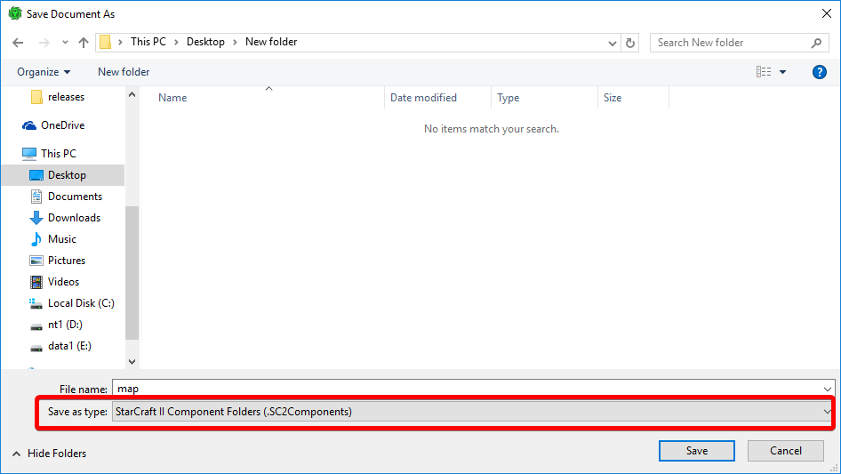
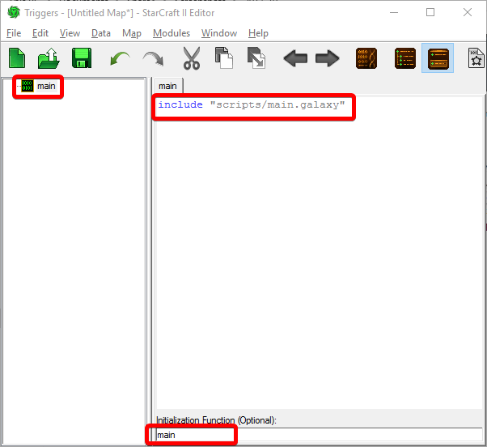
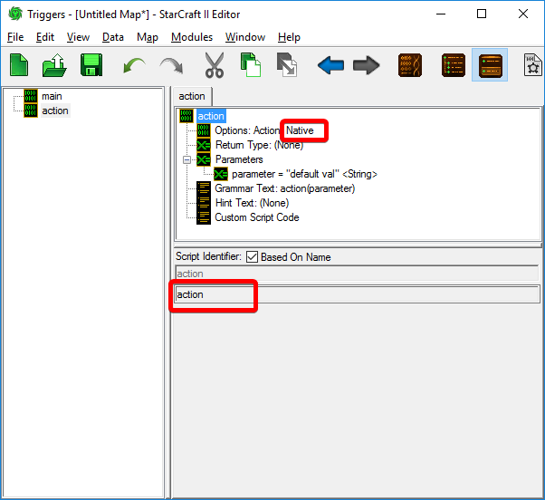
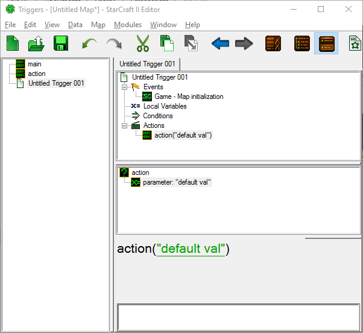

## How to use this extension in combination with **SC2 Editor**

To avoid copy-pasting code into **Custom script element** within trigger editor, or manually reimporting *.galaxy* files after every change, it is advised to save the map in unpacked format - that is **.SC2Components** in save dialog.



This will expose your map files to be accessed through the filesystem, then simply open map directory within **VS Code editor**.

It's also advised to not write your code directly to `MapScript.galaxy` as it might be easly overridden by **Trigger module** of **SC2 Editor**. The better way is to create a **Custom script element** and include your scripts in there.

Scripts can be saved in any directory within the map, even root directory. No manual file re-importing in **SC2 Editor** is required. Your scripts will be read on demand - always up to date.

For Example:



Note the **Initialization Function** at the bottom

Inside your map directory create new folder named `scripts`. There you can insert your galaxy files:

`scripts/main.galaxy`:
```c
bool onInit(bool testConds, bool runActions) {
    UIDisplayMessage(PlayerGroupActive(), c_messageAreaSubtitle, StringToText("HELLO WORLD"));
    return true;
}

void main() {
    // this is your entry point
    TriggerAddEventMapInit(TriggerCreate("onInit"));
}
```

### Mixing GUI Elements with Custom scripts

It is possible to declare certain **Functions** and **Actions** as **Native** within **Trigger module**. This basically just creates a reference to a function you must declare on your own.



Then somewhere in your scripts make a declaration:

```c
void action(string parameter) {
    // ...
}
```

Such action can be used in **Trigger module**.



### Example maps

- [sc2-sef](https://gitlab.com/Talv/sc2-sef) - **Ice Baneling Escape: Cold Voyage** in *Arcade*.